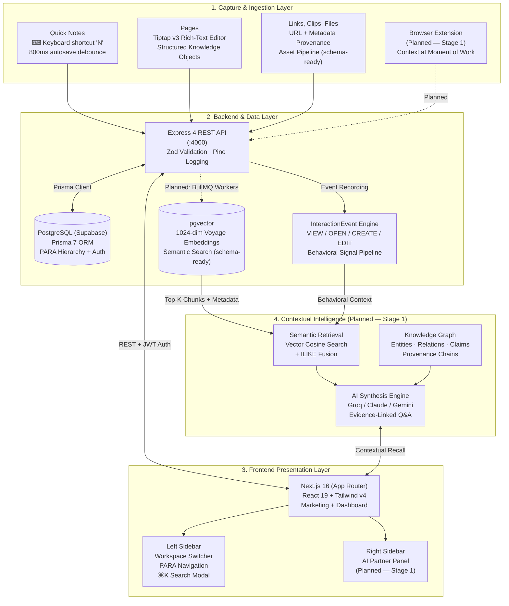

<div align="center">

# HypeMind

### The Personal Context Infrastructure & Knowledge Memory Engine

_A workspace that remembers — closing the loop between Capture, Context, Memory, Retrieval, and Action._

[](https://turbo.build/repo)
[](https://nextjs.org/)
[](https://expressjs.com/)
[](https://supabase.com/)
[](https://www.typescriptlang.org/)
[](https://tailwindcss.com/)
[](#-inviolable-core-principles)
[](LICENSE)

<br />

```text
               ┌────────────────────────────────────────────────────────┐
               │                       CAPTURE                         │
               │       Quick Notes, Pages, Links, Clips, Files         │
               └───────────────────────────┬────────────────────────────┘
                                           │
                                           ▼
               ┌────────────────────────────────────────────────────────┐
               │                    CONTEXT LAYER                       │
               │     PARA Hierarchy: Areas → Projects → Items           │
               │     Workspace Isolation · Tags · Provenance Metadata   │
               └─────────────┬────────────────────────────┬─────────────┘
                             │                            │
                             ▼                            ▼
              ┌───────────────────────────┐  ┌───────────────────────────┐
              │    STRUCTURED MEMORY      │  │    BEHAVIORAL SIGNALS     │
              │    Knowledge Graph        │  │    InteractionEvents      │
              │    Vector Embeddings      │  │    Views, Opens, Edits    │
              │    Provenance Chains      │  │    Trending & Recency     │
              └──────────────┬────────────┘  └────────────┬──────────────┘
                             │                            │
                             └─────────────┬──────────────┘
                                           │
                                           ▼
               ┌────────────────────────────────────────────────────────┐
               │              CONTEXTUAL RECALL & SYNTHESIS             │
               │    Semantic Retrieval · Evidence-Linked Q&A · Briefs   │
               └───────────────────────────┬────────────────────────────┘
                                           │
                                           ▼
               ┌────────────────────────────────────────────────────────┐
               │                    INFORMED ACTION                     │
               │     Decisions with Provenance · Research Synthesis     │
               │     "I remember this, and here's why I believe it."   │
               └────────────────────────────────────────────────────────┘
```

</div>

---

## 🎯 Executive Vision: The Problem HypeMind Solves

Knowledge work is drowning in capture tools that never close the loop. The market has failed in two predictable ways:

1. **AI Notes Apps** (_"Take notes, AI organizes them"_): Commoditized overnight. Every notes app bolted on a chat sidebar. No defensible value because the AI has no understanding of _your_ context — it just sees text.
2. **AI Knowledge Workspaces** (_"Store everything, ask questions"_): Better, but still reduces to a retrieval layer over documents. They search what you _stored_, not what you _know_. They cannot reconstruct _why_ you made a decision or how your understanding evolved.

### The Missing Link: Personal Context Infrastructure

HypeMind is **not** a notes app, a bookmark manager, an AI chat wrapper, a "second brain," or a task manager. It is a **personal context infrastructure** — a system that captures not just information, but the _context in which it mattered_, and gives that context back when it becomes useful again.

$$\text{Capture} \longrightarrow \text{Context Accumulates} \longrightarrow \text{AI Understands} \longrightarrow \text{User Returns} \longrightarrow \text{HypeMind Recalls} \longrightarrow \text{User Acts}$$

It answers the **Three Foundational Questions** of knowledge work:

- **What do I know about this?** _(Knowledge graph + accumulated context + provenance)_
- **How did my understanding evolve?** _(Decision history, source chains, contradictions surfaced)_
- **What should I do with what I know?** _(Evidence-linked research synthesis + contextual recommendations)_

### The MVP Success Criterion

> Can a user give HypeMind enough context that, one or two weeks later, HypeMind can recover something genuinely useful that the user themselves could not easily reconstruct?

---

## 🧭 The Three HypeMinds: What We Are Building (and What We Are Not)

The strategic clarity of this project requires understanding three concentric product definitions — and which one we are pursuing:

| #   | Positioning                        | Value Proposition                                                                              | Verdict                                          |
| :-- | :--------------------------------- | :--------------------------------------------------------------------------------------------- | :----------------------------------------------- |
| 1   | AI Notes App                       | _"Take notes, AI organizes them."_                                                             | **Commoditized. Do not build this.**             |
| 2   | AI Knowledge Workspace             | _"Store everything, ask questions."_                                                           | **Crowded. Better than #1, not sufficient.**     |
| 3   | **Personal Context Infrastructure** | _"Remembers what you were doing, why it mattered, and gives that context back when useful."_   | **✅ The direction we are pursuing.**              |

The current codebase is a solid **HypeMind #1/#2** — a competent capture-and-organize CRUD workspace. The strategic mission is to prove **HypeMind #3**: the memory loop where accumulated context becomes genuinely more valuable than the sum of its stored parts.

### The Two Capabilities the First Product Must Prove

1. **"It remembers what I know"** — Knowledge graph + contextual memory + provenance. Not keyword search over documents — _reconstructed understanding_.
2. **"It helps me use what I know"** — Research synthesis + evidence linking + contradiction detection. Not a chatbot — an _informed collaborator_.

Everything else — meetings, Gmail/Slack/GitHub integrations, skills/agents — stays subordinate until these two are proven.

---

## 🚫 What HypeMind is NOT (Scope Discipline)

Knowing what _not_ to build is as important as the roadmap:

| What It Is Not                   | Why                                                                                                                            |
| :------------------------------- | :----------------------------------------------------------------------------------------------------------------------------- |
| **A "second brain"**             | That is a category metaphor where the user does all the maintenance. HypeMind maintains its own understanding.                 |
| **A meeting transcription tool** | Mature category. Meetings are only ever an _ingestion source_ feeding decisions into the graph — never the product itself.      |
| **Integrations-first**           | Gmail, Slack, GitHub are context _sources_, built only after the core memory loop works. Do not sell plumbing as the product.   |
| **Skills/agents-first**          | Sell outcomes, not architecture. Agents operate _within_ HypeMind's accumulated context layer — they are not the context layer. |
| **Migration-dependent**          | Must be useful without importing 4,000 Notion pages. Capture 10 things → ask → activation.                                    |
| **A generic AI chat sidebar**    | If the value is "a better chat UI over your notes," do not build it. The value is the _context infrastructure_ behind it.      |

---

## ⚡ Inviolable Core Principles

### 1. Context Over Features

Adding more CRUD surfaces does not prove the product thesis. Every feature must contribute to the memory loop: _Capture → Context Accumulates → HypeMind Understands → User Recalls → User Acts_. If a feature does not strengthen this loop, it is scope creep.

### 2. Provenance Over Graph

Every claim should be inspectable. Asking _"Why did I decide not to use Redis?"_ should reconstruct:

```text
Decision → Related Discussions → Constraints → Research
→ Alternatives Considered → Final Decision → Evidence
```

The trust mechanism is: _"I remember this, and here's why I believe it."_ This requires first-class provenance chains — not just embeddings in a vector database.

### 3. Pages Are Knowledge Objects, Not Documents

Pages are **not** the product; they are the _interface_ to the memory system. A page is:

```text
Content + Context + Sources + Related Items + AI Understanding + History
```

A document editor that does not show what HypeMind _knows about this page_ has failed its purpose.

### 4. Model-Agnostic Context Infrastructure

Own the user's structured context; make the reasoning model replaceable:

```text
            GPT / Claude / Gemini / Groq
                       │
                    HypeMind
                       │
            Personal Context Layer
            ┌──────────┼──────────┐
       Knowledge    Sources     History
         Graph
```

If the frontier model is the value, the product is indefensible. If the _context infrastructure_ is the value, frontier models become commodity reasoning engines behind it.

### 5. Schema Headroom Over Runtime Scope

The database schema intentionally anticipates capabilities the runtime has not yet reached (`VectorEmbedding`, `InteractionEvent`, `aiSummary`, `searchVector`, `Asset.extractedText`). This is deliberate: the data model defines the architectural contract; the runtime catches up through staged delivery.

---

## 🏗️ End-to-End System Architecture



---

## 📦 Monorepo Architecture

Managed with [Turborepo](https://turbo.build/repo) and [pnpm](https://pnpm.io/) v9 workspaces:

### Applications (`apps/`)

| Application | Technology | Port | Description |
| :---------- | :--------- | :--- | :---------- |
| [`apps/web`](apps/web) | **Next.js 16**, React 19, Tailwind CSS v4 | `:3000` | Marketing site + dashboard: workspace navigation, PARA hierarchy, quick notes, pages, search (⌘K), trash management, and AI partner panel (planned). |
| [`apps/api`](apps/api) | **Express 4**, Prisma 7, Pino, Zod | `:4000` | REST API handling auth (argon2id + JWT + rotating refresh tokens), CRUD operations across the PARA hierarchy, search, and workspace membership. |

### Core Packages (`packages/`)

| Package | Purpose |
| :------ | :------ |
| [`@repo/db`](packages/db) | Prisma 7 schema, PostgreSQL client (Supabase), migrations, and seed scripts. The schema is the architectural source of truth — intentionally ahead of the runtime. |
| [`@repo/validation`](packages/validation) | Zod schemas for auth, quick notes, and onboarding. Shared contract between API and frontend validation. |
| [`@repo/ui`](packages/ui) | shadcn-style component library (button, card, dialog, dropdown, input, badge, panel, surface, resizable) + centralized `theme.css` design tokens. |
| [`@repo/eslint-config`](packages/eslint-config) | Shared ESLint configuration across the monorepo. |
| [`@repo/tailwind-config`](packages/tailwind-config) | Shared Tailwind CSS v4 configuration and design tokens. |
| [`@repo/typescript-config`](packages/typescript-config) | Shared TypeScript `tsconfig` base configurations. |

---

## 🔐 Authentication & Security Architecture

HypeMind implements a custom, production-grade authentication system — no third-party auth providers required:

```text
Signup ──► User + personal Workspace + WorkspaceMember(OWNER)
           + WorkspaceSetting + UserSetting created in ONE transaction
       ──► Verification email (Resend) with 10-min HMAC token

Login  ──► argon2id hash verification
       ──► emailVerified gate
       ──► Access JWT (HS256, 15-min TTL, random jwtid)
           returned in JSON body
       ──► Refresh token: userId + 48-byte hex, stored as
           HMAC-SHA256 digest, 7-day TTL, raw value ONLY in
           httpOnly cookie + non-httpOnly signal cookie for
           Next.js middleware UX gate

Refresh ─► Cookie-based rotation in a transaction; revoked tokens
           get a 10s reuse grace window (parallel-tab tolerance)

/auth/me ─ Bearer JWT verify → fallback bootstrap from refresh cookie
           (cookie-only first load after login)

Password Reset ──► 1h one-time HMAC token → hash new password
                → revoke ALL refresh tokens → auto-login
```

**Security layers**: Helmet headers · CORS origin whitelist · `express-rate-limit` (global 1000/15min, auth 80/15min) · httpOnly + Secure + SameSite cookies · Argon2id password hashing · HMAC token digests (never stored in plaintext).

---

## 🗄️ Database Schema: The Architectural Source of Truth

The Prisma schema is deliberately designed _ahead_ of the runtime — it defines the data contract for the full product vision:

```text
User ─┬─ RefreshToken / PasswordResetToken / EmailVerification
      ├─ UserOAuthAccount                    (ready for Google OAuth)
      ├─ UserSetting                         (onboarding, goals[])
      └─ WorkspaceMember ──► Workspace
                               ├─ WorkspaceSetting
                               ├─ Area ──► Project ──► Item
                               ├─ Item (standalone = Inbox)
                               ├─ Tag ── ItemTag ── Item
                               └─ InteractionEvent

Item ─┬─ Asset              (files: storageKey, extractedText)
      ├─ PublicShare         (tokenHash share links)
      └─ VectorEmbedding    (pgvector 1024-dim chunks)
```

### Key Design Decisions

| Model | Design | Rationale |
| :---- | :----- | :-------- |
| **Item** | Universal knowledge object with `type` enum (`QUICK_NOTE`, `PAGE`, `JOURNAL`, `TASK`, `LINK`, `FILE`, `SOCIAL_CLIP`) | Single table for all content types enables unified search, tagging, and graph relationships. |
| **VectorEmbedding** | `vector(1024)` via pgvector, chunked, with `model` field defaulting to `voyage-4` | Schema-ready for semantic retrieval. Embedding model is explicit for future multi-model support. |
| **InteractionEvent** | 11 action types (`VIEW`, `OPEN`, `CREATE`, `EDIT`, `TRASH`, `PIN`, `CLIP`, `DUPLICATE`, `ARCHIVE`, `RESTORE`, `SHARE`) | Behavioral signal pipeline: the foundation for trending suggestions, recency ranking, and "what was I working on" recall. |
| **Item.aiSummary / aiMetadata** | Text + JSON fields on every Item | Hook points for contextual intelligence — AI-generated understanding stored alongside the source material. |
| **Item.searchVector** | `tsvector` column (PostgreSQL full-text) | Full-text search readiness, complementing vector similarity for hybrid retrieval. |
| **Asset.extractedText** | Extracted text from uploaded files | Enables future indexing and search across file attachments without re-processing. |

---

## 🤖 The Contextual Intelligence Engine (Planned — Stage 1)

HypeMind's AI layer is designed as a **context-aware reasoning engine**, not a generic chatbot. The architecture ensures AI operates on _structured understanding_, not raw data dumps:

```text
  [ User captures 20 items over 2 weeks:
    notes, pages, links, research, decisions ]
                     │
                     ▼
  [ Vector Embedding Pipeline (BullMQ + Voyage AI):
    - Chunk items into semantic segments
    - Generate 1024-dim embeddings
    - Store with provenance metadata ]
                     │
                     ▼
  [ User asks: "What have I learned about X so far?" ]
                     │
                     ▼
  [ Hybrid Retrieval Engine:
    - pgvector cosine similarity (semantic)
    - ILIKE full-text search (keyword)
    - InteractionEvent recency weighting
    - Source provenance chain reconstruction ]
                     │
                     ▼
  [ LLM Synthesis (Groq / Claude / Gemini):
    - Evidence-linked answer with source citations
    - Contradictions surfaced between sources
    - Evolution of understanding over time
    - Decision history reconstruction ]
```

**Dependencies installed and ready**: `groq-sdk`, `voyageai`, `bullmq`, `ioredis`. Runtime wiring is the next major milestone.

### Magic Moments to Design For

1. **After capturing 10–20 items over days**: Ask _"What have I learned about X so far?"_ → Get an evolution of understanding with evidence links, contradictions surfaced, related entities.
2. **Give a real research task**: _"I'm deciding PostgreSQL vs MongoDB — research based on everything I've already learned"_ → Existing knowledge + external research + conflict detection → synthesis → recommendation with evidence.

---

## 🚀 Quick Start & Local Development

### Prerequisites

- **Node.js**: `v18.0.0` or higher
- **Package Manager**: `pnpm` (`v9.0.0`+)
- **Database**: PostgreSQL (recommended: [Supabase](https://supabase.com/) free tier with pgvector enabled)

### 1. Clone & Install

```bash
git clone https://github.com/PrateekSingh43/hypemind.git
cd hypemind
pnpm install
```

### 2. Environment Configuration

Create environment files from examples:

```bash
# API environment (database URL, JWT secrets, Resend API key)
cp apps/api/.env.example apps/api/.env

# Web environment (API base URL)
cp apps/web/.env.example apps/web/.env
```

Required environment variables for `apps/api/.env`:

| Variable | Purpose |
| :------- | :------ |
| `DATABASE_URL` | Supabase Postgres connection string (pooling) |
| `DIRECT_URL` | Supabase Postgres direct URL (for migrations) |
| `JWT_SECRET` | HMAC-SHA256 secret for access tokens |
| `REFRESH_SECRET` | HMAC secret for refresh token hashing |
| `RESEND_API_KEY` | [Resend](https://resend.com/) key for transactional emails |
| `CLIENT_URL` | Frontend URL for CORS and email links |

_Default Ports:_

- **Express API**: `http://localhost:4000`
- **Next.js Web UI**: `http://localhost:3000`

### 3. Initialize Database

```bash
# Generate Prisma client
pnpm --filter @repo/db db:generate

# Run migrations (requires DIRECT_URL in .env)
pnpm --filter @repo/db db:migrate
```

### 4. Run Development Services

Start all monorepo services concurrently via Turborepo:

```bash
pnpm dev
```

Or run individual services in dedicated terminals:

```bash
# Terminal 1: Express API (:4000)
pnpm --filter api dev

# Terminal 2: Next.js Frontend (:3000)
pnpm --filter web dev
```

Visit [`http://localhost:3000`](http://localhost:3000) to view the HypeMind dashboard.

---

## 🧪 Verification & Quality

```bash
# TypeScript strict compilation across all packages
pnpm check-types

# Monorepo-wide linting
pnpm lint

# Production builds (Next.js + tsup)
pnpm build
```

---

## 🗺️ Staged Roadmap

HypeMind follows a strict staged delivery plan — each stage must _prove_ its thesis before the next begins:

| Stage | Proves | Builds | Status |
| :---- | :----- | :----- | :----- |
| **1 — Contextual Memory** | _"It remembers what I would otherwise reconstruct"_ | Quick capture ✅, pages ◐, browser extension, knowledge graph, semantic retrieval, provenance, contextual Q&A | **In Progress** |
| **2 — Research Synthesis** | _"Helps me understand a domain, not just retrieve notes"_ | Source ingestion, evidence linking, contradiction detection, research briefs | Planned |
| **3 — Connected Work** | _"Understands my work across apps"_ | GitHub, Slack, Gmail, calendar/meetings integrations as context _sources_ | Planned |
| **4 — Action** | _"Operates within my context"_ | Skills/agents: research, writing, coding, planning — all grounded in accumulated context | Planned |

### Current State (Honest Assessment)

#### ✅ What Works End-to-End Today
- **Authentication**: Full email/password stack — signup → email verification (Resend) → login → JWT + rotating refresh cookie → password reset → logout.
- **Multi-Workspace**: Create, switch, and manage workspaces with OWNER/ADMIN/MEMBER roles.
- **PARA Hierarchy**: Areas → Projects → Items with soft-delete trash (30-day semantics), pinning, duplication.
- **Quick Notes**: Genuinely complete. Create via `N` key or sidebar `+` → autosave (800ms debounce) → cross-component sync → pin/trash/duplicate/assign-to-project.
- **Pages**: List, create, duplicate, pin, trash all work at the data level.
- **Trash**: List, restore, permanent delete — grouped by type, with countdown UI.
- **Search (⌘K)**: ILIKE text search + interaction-based suggestions.

#### ◐ Partially Built
- **Rich-text editing**: Tiptap v3 extensions installed; editor component is a stub (previous implementation deleted during refactor). This is the current blocking dependency.
- **Interaction events**: Schema supports 11 action types; only `CREATE` and `DUPLICATE` are written. Trending suggestions are structurally empty until `VIEW`/`OPEN`/`EDIT` events are recorded.
- **AI Partner sidebar**: UI panel exists; backend endpoint (`POST /ai/chat`) does not.

#### ❌ Not Built Yet (Strategic Backlog)
- **Semantic/vector search** — pgvector column + Voyage AI ingest script exist; no query path uses embeddings.
- **Knowledge graph / provenance / contextual recall** — the core differentiator. Only `InteractionEvent` + `aiSummary` fields gesture at it.
- **AI synthesis layer** — `groq-sdk`, `bullmq`, `ioredis` installed; zero usage in API source.
- **Browser extension** — nothing in the repo.
- **Google OAuth** — env vars + DB model present, no handler code.

---

## 📖 Documentation

The [`docs/`](docs/) directory contains the complete product and engineering specification:

| Document | Contents |
| :------- | :------- |
| [`01-product-vision.md`](docs/01-product-vision.md) | Strategy: problem, ICP, differentiators, the three HypeMinds, MVP criterion, staged roadmap |
| [`02-system-architecture.md`](docs/02-system-architecture.md) | Monorepo layout, tech stack, auth flows, state management patterns, deployment reality |
| [`03-database-schema.md`](docs/03-database-schema.md) | Full Prisma schema walkthrough + design observations |
| [`04-api-surface.md`](docs/04-api-surface.md) | Complete route table, auth architecture, search/AI implementation status |
| [`05-web-app.md`](docs/05-web-app.md) | Every dashboard route, editor situation, sidebar deep dive, marketing site |
| [`06-current-state-audit.md`](docs/06-current-state-audit.md) | What is REAL vs MOCKED vs MISSING; bugs; security findings; code-quality observations |
| [`07-vision-vs-code-roadmap.md`](docs/07-vision-vs-code-roadmap.md) | Gap analysis: what Stage 1 requires vs what exists; recommended next steps |

---

## 🎯 ICP: Who This Is For

**Research-heavy technical professionals**: senior software engineers, technical founders, indie hackers, engineering leads — people on long-lived projects where research and decision history accumulate over weeks and months.

Their expensive pain: _"I know I've already figured this out somewhere, but I can't reconstruct the context."_

- **ROI math**: ~20 min × 3×/week reconstructing decision context ≈ 4 hrs/month → $10–20/month is rational.
- **Not** generic students, casual note-takers, or planners. The tool is built for deep, continuous technical work.

---

## ⚖️ License & Proprietary Notice

Copyright &copy; 2026 Prateek Singh. **All Rights Reserved. Proprietary and Confidential.**

Unauthorized copying, distribution, modification, public deployment, hosting, or commercial exploitation of this software or its services without prior written permission is strictly prohibited. See [`LICENSE`](LICENSE) for full legal terms and commercial licensing inquiries.

<div align="center">
<sub>Crafted for research-heavy builders who need their tools to remember as deeply as they think.</sub>
</div>
